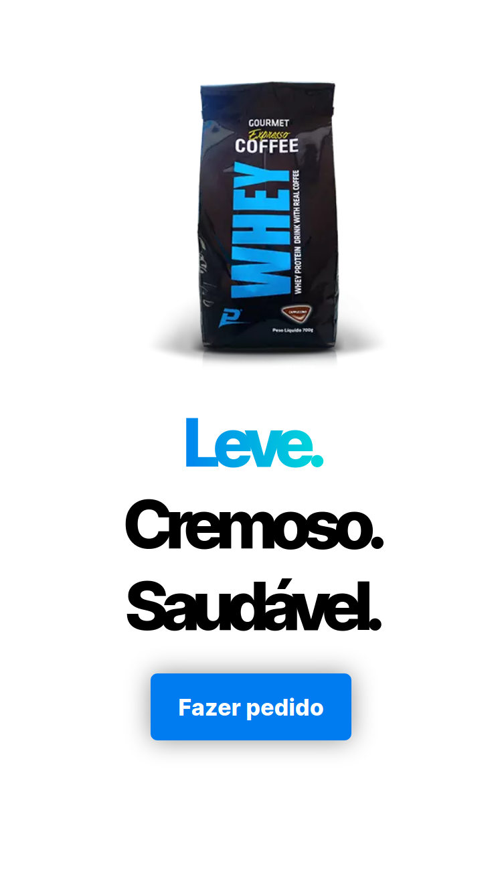
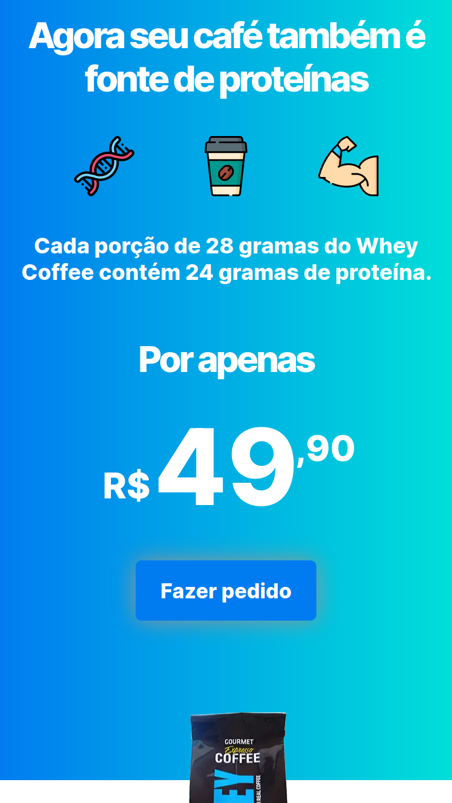
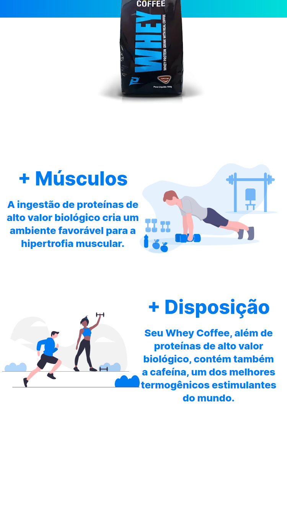
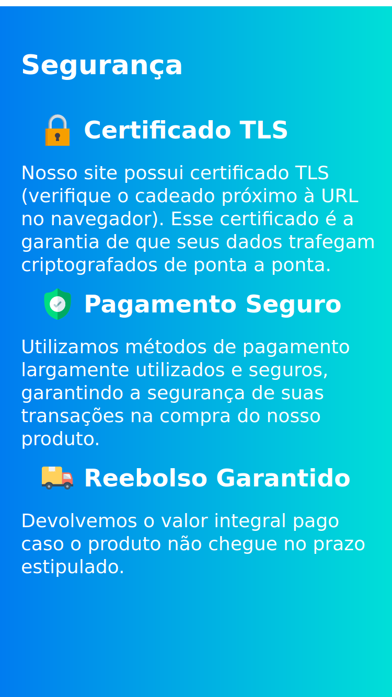
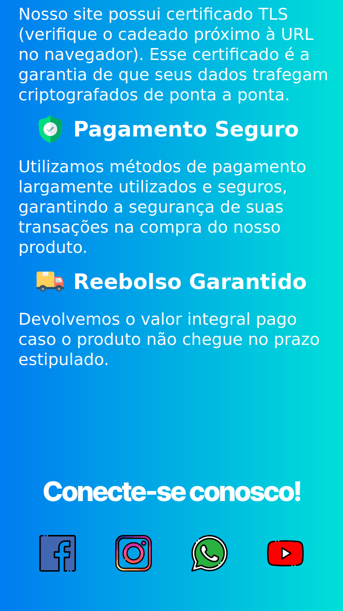
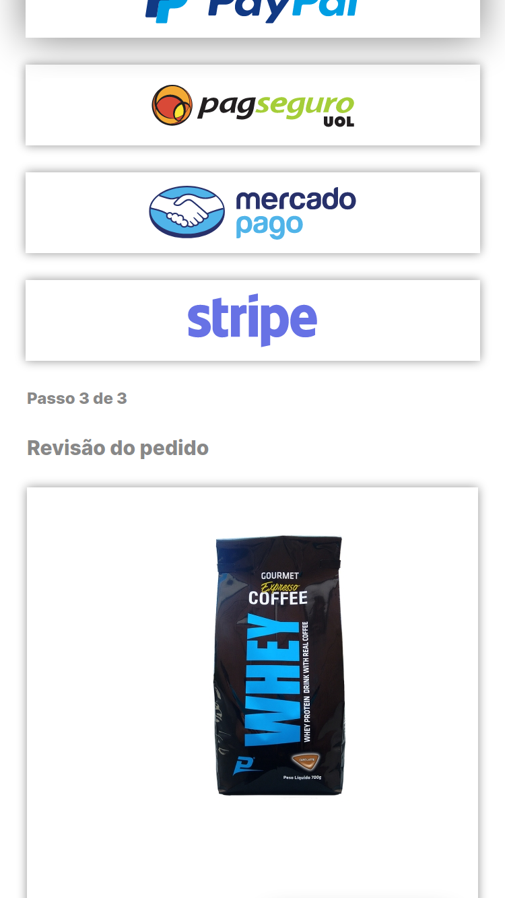
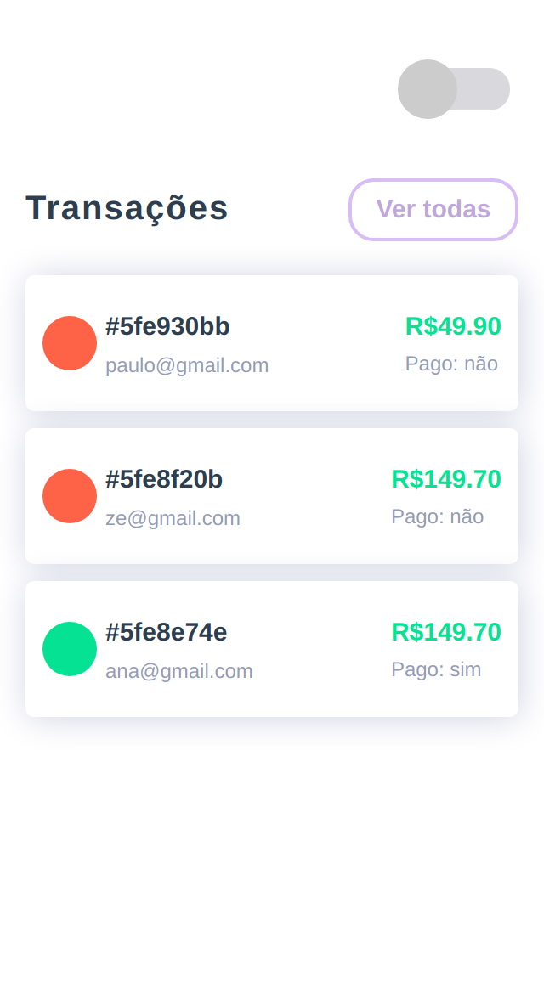
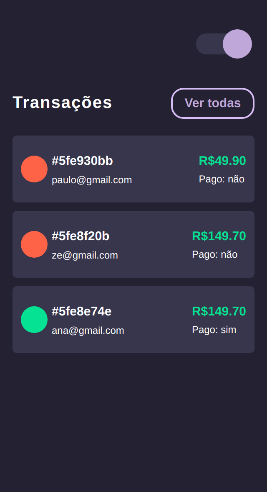
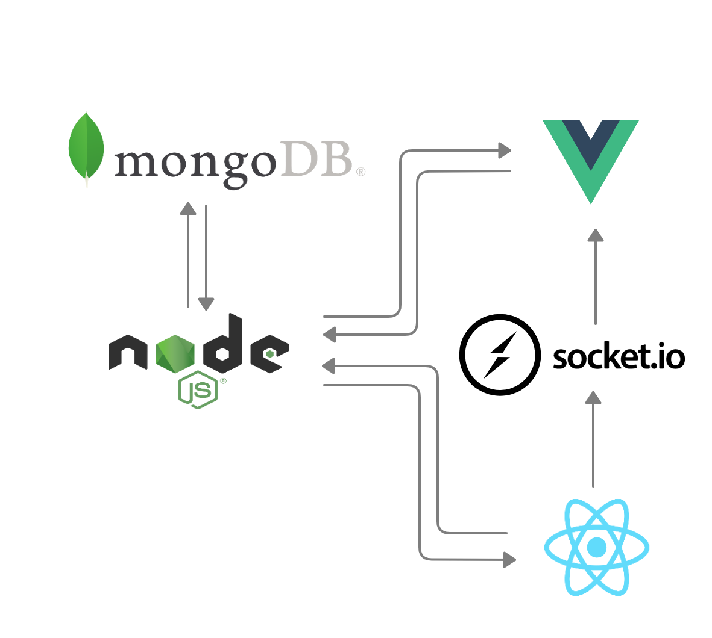
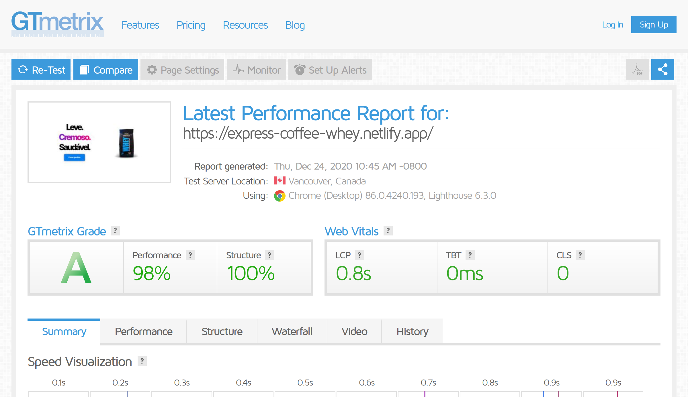

<h3 align="center">:construction: Under construction :construction:</h3>

  <a href="#hearts-about">About</a>&nbsp;&nbsp;&nbsp;|&nbsp;&nbsp;&nbsp;
  <a href="#headphones-technologies">Technologies</a>&nbsp;&nbsp;&nbsp;|&nbsp;&nbsp;&nbsp;
   <a href="#running-running">Running</a>&nbsp;&nbsp;&nbsp;|&nbsp;&nbsp;&nbsp;
  <a href="#pray-acknowledgments">Acknowledgments</a>&nbsp;&nbsp;&nbsp;

<h2 align="center">
  

    
    
    
    
  

</h2>

### :hearts: About

**Landing Shop App** is a simple web app which allows you selling a product easily by implementing some famous payment methods. For now, the only one working is Stripe.
The **source code repositories** and the **deployed website** can be found here:

- [**Website**](https://express-coffee-whey.netlify.app/) :arrow_upper_right: 
- [**Landing Page (React)**](https://github.com/higorcastilho/coffee-landing) 
- [**Dashboard (Vue.js)**](https://github.com/higorcastilho/coffee-dashboard)
- [**Socketio Service (Node)**](https://github.com/higorcastilho/coffee-socketio)
- [**Back-end (Node)**](https://github.com/higorcastilho/coffee-backend)

<h2 align="center">
  

    
    
    
    
  

</h2>

It has also a **dashboard page** built with Vue.js where you can track your sales: 

<h2 align="center">
    
</h2>

### :headphones: Technologies

<h2 align="center">
  

    
    
  

</h2>

**Some strategies** to a faster page load: 
- React.lazy and Suspense are being used to perform a faster page load.
- SVG and WEBP image extensions are prioritized.

### :running: Running

To start running locally:

- **React front-end**: clone [**this repository**](https://github.com/higorcastilho/coffee-landing) and issue **docker-compose up -d --build** on terminal. Go to http://localhost:3001.
- **Dashboard front-end**: clone [**this repository**](https://github.com/higorcastilho/coffee-dashboard), run **npm install** and then **npm run serve**. Go to http://localhost:8080.
- **Socketio Service**: clone [**this repository**](https://github.com/higorcastilho/coffee-socketio), set up your env.js file inside src/main/config/env.js, based on env.example.js and issue **docker-compose up** on terminal. Server will be running on port 5000.
- **Node.js back-end**: clone [**this repository**](https://github.com/higorcastilho/coffee-backend), set up your stripe secret key (env.example.js has most of the settings already) inside src/main/config/env.js and issue **docker-compose up** on terminal. Server will be running on port 5858.

### :pray: Acknowledgments

All thanks to:
- [Flaticon, Freepik, Smashicon and Roundicons](https://www.flaticon.com/), and also to [unDraw](https://undraw.co/illustrations), for the handsome svgs.
- [Rodrigo Mango](https://www.youtube.com/channel/UCabelTt5YHot17aKb19VRNA) for the awesome classes about TDD and Clean Architecture.
- [Rocketseat](https://www.youtube.com/watch?v=204ewU7NRO0&t=187s) for the tutorial on how to animate the main title of the landing page.
