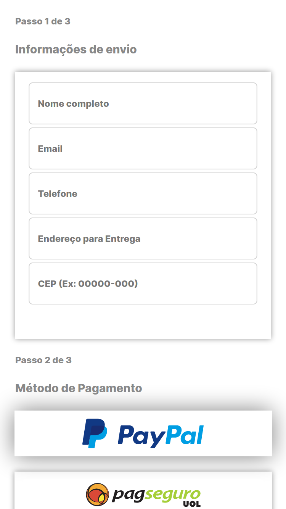
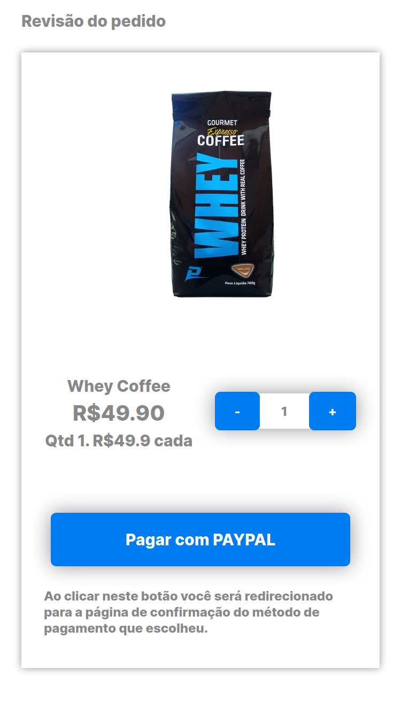
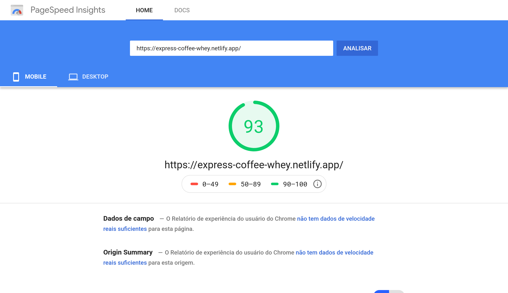

<h3 align="center">:construction: Under construction :construction:</h3>

  <a href="#hearts-about">About</a>&nbsp;&nbsp;&nbsp;|&nbsp;&nbsp;&nbsp;
  <a href="#headphones-technologies">Technologies</a>

<h2 align="center">
  

    
    
    
    
  

</h2>

### :hearts: About

**Landing Shop App** is a simple web app which allows you selling a product easily by implementing some famous payment methods. For now, the only one working is Stripe.
The **source code repositories** and the **deployed website** can be found here:

- [Website](https://express-coffee-whey.netlify.app/) :arrow_upper_right: 
- [Front-end](https://github.com/higorcastilho/coffee-landing) (How to run locally and +)
- [Back-end](https://github.com/higorcastilho/coffee-backend) (How to run locally and +)

<h2 align="center">
  

    
    
    
    
  

</h2>

### :headphones: Technologies

<h2 align="center">
  

    
    
    
  

  
As soon as possible

</h2>

